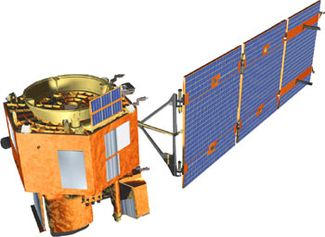
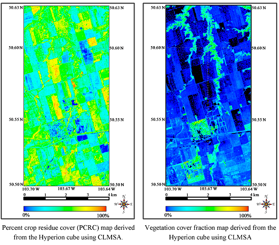
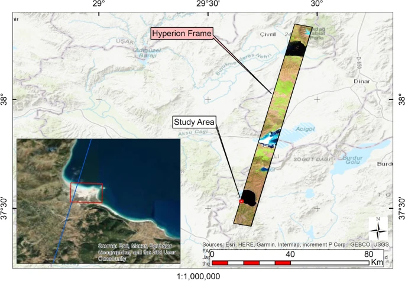
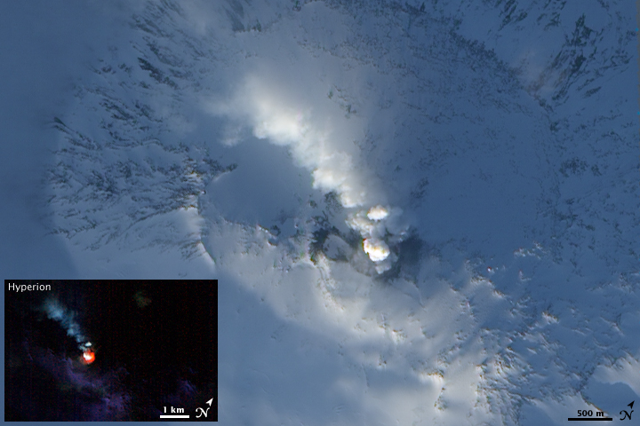

```{r setup, include=FALSE}
options(htmltools.dir.version = FALSE)
```


## A significant advancement in spectral imaging 

Hyperspectral imaging (HSI) is a technique that collects and analyses data across the electromagnetic spectrum to produce images with a high spectral resolution. 

It captures HUNDREDS sometimes THOUSANDS of narrow neighboring spectral bands. 

It was the first hyperspectral imaging sensor capable of capturing full high-resolution spectral data (220 spectral bands) across the visible to shortwave infrared spectrum (400–2500 nm).

Each band has a very fine spectral resolution allowing for more detailed analysis.

---

### An example of hyperspectral imaging (Image: Forschungszentrum Jülich)
<div style="text-align: center;">

<p>Displays imaging comparisons, highlighting reduced oxyhemoglobin and deoxyhemoglobin levels in PAD-affected feet (Image Chin et al., 2011).</p>
</div>

---

# What is Hyperion?

Hyperion is a hyperspectral sensor that enables scientists to see the chemical constituents of the Earth’s surface in fine detail (spatial resolution of 30m).

NASA's EO-1 (Earth Observing-1) satellite carried Hyperion when it was launched in 2000.

EO-1 was Initially meant to be a 1 year satellite mission, however was extended due to its sensors providing valuable data for scientific research. 

Based on this user interest and willingness to assist in funding continued operations, an agreement was reached between NASA and the United States Geological Survey to allow continuation of the EO-1 Program as an Extended Mission.

<div style="text-align: center;">
  
  
  <p)>
     EO-1 Satellite (Image: NASA).</p>
     </div>

However, it was decommissioned in 2017 as it did not have enough fuel to stay in orbit. 

---

#### Spatial Variability Mapping of Crop Residue Using Hyperion (EO-1) Hyperspectral Data (Bannari et al., 2015)

<div style="text-align: center;">

</div>

This paper explored the use of Hyperion data with constrained linear spectral and mixture analysis (CLMSA) to estimate crop residue cover in Saskatchewan, Canada. The results found that maintaining crop residue enhances soil structure and CO2 fixation, while reducing erosion. This could not have been achieved without Hyperion due to its high spectral resolution. 

---

### The study of mineral distribution using Hyperspectral Hyperion data along the shores of Lake Salda/Turkiye (Akgül and Ural). 

<div style="text-align: center;">

</div>

This study explores mineral locations near lake Salda using hyperion data. The results suggested significant mineral compositions, including 35% trona and 26.3% ulexite. 

Helps us to understand the area's geology. 
And a similar mineral composition has been found on Mars… 

Hyperion's ability to capture data across a wide range of wavelengths enabled researchers to identify various minerals by this lake with high precision.

---

### Real life applications: Volcanic Activity on Mt Erebus. 

<div style="text-align: center;">

</div>

Hyperion was used on Mount Erebus to detect thermal emissions from its active lava lake.

On February 6th 2009, Hyperion captured data that highlighted areas of intense heat, showcasing its ability to identify volcanic activity even under challenging conditions like Antarctica's ice.

By measuring heat, scientists were able to pinpoint thermal anomalies, such as molten lava.

---

### Reflection:

Hyperion was an exceptional innovation in Earth observation with its hyperspectral capabilities.

The sensor allowed researchers to explore various topics ranging from crop residue mapping in Saskatchewan to mineral identification near Lake Salda in Turkey, advancing knowledge in agriculture, geology, and planetary science.

However, hyperspectral imaging sensors are expensive to develop and maintain, limiting accessibility. Likewise, while hyperions data was groundbreaking it is not necessary in many use cases.

---

#### Referenes

Akgül, M.A., Ural, S. (2024) The study of mineral distribution using hyperspectral Hyperion data along the shores of Lake Salda/Türkiye. Environ Earth Sci 83, 219.

Bannari, A. et al. (2015) Spatial Variability Mapping of Crop Residue Using Hyperion (EO-1) Hyperspectral Data. Remote sensing (Basel, Switzerland), 7 (6), 8107–8127.

Chin, J. A., Wang, E. C., & Kibbe, M. R. (2011). ‘Evaluation of hyperspectral technology for assessing the presence and severity of peripheral artery disease’. Journal of Vascular Surgery, 54, (6), 1679–1688. 

EO-1 (earth observing-1) (no date) eoPortal. (https://www.eoportal.org/satellite-missions/eo-1#mission-capabilities, Accessed: 26 January 2025). 

EO-1 sensors (no date) USGS. Available at: https://www.usgs.gov/centers/eros/eo-1-sensors (Accessed: 23 January 2025). 

Hyperspectral imaging for Environmental Monitoring (2024) Specim. (https://www.specim.com/hyperspectral-imaging-applications/environmental-monitoring/, Accessed: 23 January 2025). 

#### Thanks!

Slides created via the R package [**xaringan**](https://github.com/yihui/xaringan).


